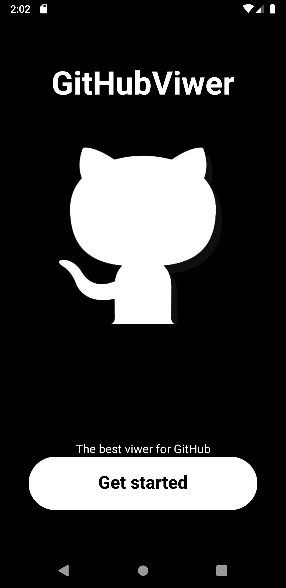
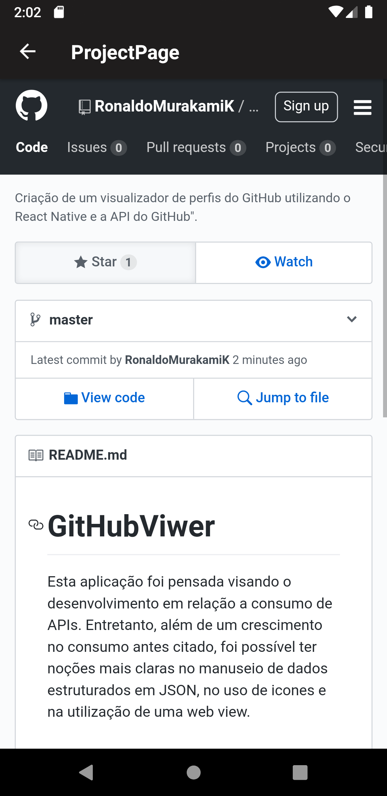

<h1 align="center">
    GitHubViwer
</h1>

# 📋 ABSTRACT
<strong>English:</strong> This application was designed for development in relation to consumption of APIs. However, in addition to a growth in consumption mentioned above, it was possible to have clearer notions in the handling of data structured in JSON, in the use of icons and in the use of a web view.   
<strong>Português: </strong>Esta aplicação foi pensada visando o desenvolvimento em relação a consumo de APIs. Entretanto, além de um crescimento no consumo antes citado, foi possível ter noções mais claras no manuseio de dados estruturados em JSON, no uso de icones e na utilização de uma web view.   

# 📖 PROJECT DATA
React Native project consuming the gitHub API to create a user viewer.  
API: api.github.com/. 
Package: axios, react-navigation, responsive-dimensions, vector-icons, webview e gesture-handler. 
React Native version: 0.61.4.  

# 🖼 SCREENSHOTS
Imagem 1 (Initial screen); 
Imagem 2 and 3 (Main screen); 
Imagem 4 (Profile screen); 
Imagem 5 (Project screen - project 1). 
Imagem 6 (Project scree - project 2).  

                                
